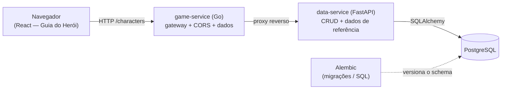

# Guia do Herói — D&D 5e

Um guia interativo de **criação e progressão de personagem** para Dungeons & Dragons 5ª edição.
Monte um personagem completo seguindo as regras 5e (atributos por compra de pontos, raças,
classes, perícias, magias e equipamento), veja a ficha pronta e explore a **trilha de classe**
nível a nível — habilidades, subclasses, talentos e magias.

> **Nota:** este projeto começou como uma plataforma com um "Mestre" (DM) por IA. A funcionalidade
> do Mestre foi **removida** e o produto foi reduzido ao guia de criação de personagem. Qualquer
> código de campanha/turno remanescente no backend é legado e pode ser limpo.

---

## Sumário

- [Funcionalidades](#funcionalidades)
- [Arquitetura](#arquitetura)
- [Estrutura do repositório](#estrutura-do-repositório)
- [Requisitos](#requisitos)
- [Como rodar](#como-rodar)
- [Banco de dados e migrações](#banco-de-dados-e-migrações)
- [Configuração](#configuração)
- [Fluxo de dados e contrato](#fluxo-de-dados-e-contrato)
- [Variantes do frontend](#variantes-do-frontend)
- [Endpoints](#endpoints)
- [Limitações e próximos passos](#limitações-e-próximos-passos)
- [Créditos e licença](#créditos-e-licença)

---

## Funcionalidades

- **Criação de personagem** — nome, raça, classe, nível, antecedente e motivação; atributos por
  compra de pontos (8–15, 27 pontos) com bônus racial aplicado automaticamente; CA, HP máximo e
  bônus de proficiência derivados.
- **Perícias e magias** — escolha de perícias por classe e seleção de truques/magias com etiqueta
  de escola e descrição em tooltip.
- **Ficha do herói** — visão somente-leitura do personagem montado (atributos, perícias, magias,
  equipamento).
- **Construtor de trilha de classe** — sobe de nível passo a passo mostrando habilidades, escolha
  de subclasse, ASIs/talentos e recursos por nível. A Tradição da **Misericórdia** (Monge) está
  totalmente detalhada; demais tradições entram como opções creditadas à fonte.
- **Glossário** — legenda dos termos de 5e (atributos, CA, proficiência, Ki, salvaguardas, etc.).

---

## Arquitetura

Três serviços com responsabilidades separadas:



- **data-service (Python / FastAPI)** — dono do Postgres. Faz o CRUD de personagens e expõe os
  dados de referência (classes, perícias, magias). Models em SQLAlchemy, schemas em Pydantic,
  migrações com Alembic.
- **game-service (Go)** — o "resto". Atua como **gateway**: repassa `/characters` para o
  data-service (proxy reverso), centraliza o **CORS** e serve a rolagem de dados. Usa apenas a
  biblioteca padrão.
- **frontend (React)** — o Guia do Herói. Fala **somente com o gateway Go**.

O navegador nunca acessa o data-service diretamente; o Go é a única origem pública.

---

## Estrutura do repositório

```
dnd-platform/
├── docker-compose.yml
├── README.md
├── data-service/                 # Python / FastAPI / SQLAlchemy / Alembic
│   ├── app/
│   │   ├── main.py               # app FastAPI + CORS
│   │   ├── database.py           # engine / sessão / Base
│   │   ├── models.py             # Character (str_/int_, skills/spells JSONB, ...)
│   │   ├── schemas.py            # CharacterCreate / Update / Out (Pydantic)
│   │   ├── crud.py               # operações de banco
│   │   ├── seed.py               # carga de dados de referência
│   │   └── routers/
│   │       ├── characters.py
│   │       └── reference.py
│   └── alembic/
│       ├── env.py
│       └── versions/
│           ├── 0001_initial.py
│           └── XXXX_character_guide_fields.py   # campos do guia
├── game-service/                 # Go (stdlib)
│   ├── main.go
│   └── internal/
│       ├── config/config.go      # DataServiceURL, AllowOrigin, porta...
│       ├── server/
│       │   ├── router.go
│       │   └── characters_gateway.go   # proxy reverso + WithCORS
│       ├── dice/dice.go
│       └── dataclient/client.go
└── frontend/
    ├── dnd_character_guide.jsx          # versão offline (window.storage)
    ├── dnd_character_guide_gateway.jsx  # versão integrada ao gateway (API)
    └── dnd_character_guide.html         # build autossuficiente (demo)
```

---

## Requisitos

- **Docker** e **Docker Compose** (caminho recomendado), ou, para rodar local sem container:
  - Python **3.11+**
  - Go **1.21+**
  - PostgreSQL **14+**
  - Node **18+** (para o frontend, se for usar bundler)

---

## Como rodar

### Com Docker Compose (recomendado)

```bash
docker compose up --build
```

Sobe Postgres, data-service e game-service. Ajuste portas/variáveis no `docker-compose.yml`
conforme o seu ambiente.

### Local, serviço a serviço

**1. Postgres** — tenha um banco rodando e exporte a URL de conexão.

**2. data-service (FastAPI)**

```bash
cd data-service
python -m venv .venv && source .venv/bin/activate
pip install -r requirements.txt
alembic upgrade head          # aplica as migrações
python -m app.seed            # (opcional) carrega dados de referência
uvicorn app.main:app --reload --port 8000
```

**3. game-service (Go)**

```bash
cd game-service
go run ./...                  # sobe o gateway (ex.: porta 8080)
```

**4. frontend**

A versão integrada é o `frontend/dnd_character_guide_gateway.jsx`. Em runtime, aponte o gateway:

```html
<script>
  window.__GATEWAY_URL__ = "http://localhost:8080";
  window.__USER_ID__ = "guia-local";
</script>
```

> Para um teste rápido **sem backend**, abra o `dnd_character_guide.html` no navegador — ele compila
> o React na hora e persiste no `localStorage`.

---

## Banco de dados e migrações

O schema é versionado com **Alembic**, que gera o SQL a partir dos models SQLAlchemy.

```bash
cd data-service
# depois de alterar app/models.py:
alembic revision --autogenerate -m "descrição da mudança"
alembic upgrade head
# reverter a última:
alembic downgrade -1
```

Os campos do guia (`background`, `motivation`, `ac`, `max_hp`, `equipment`) entram pela migração
`XXXX_character_guide_fields.py`. As listas `skills` e `spells` são **JSONB** no Postgres e
`list[str]` na API.

> Atenção a `str` e `int`: são palavras reservadas no Postgres. As **colunas** se chamam `"str"`/
> `"int"` (citadas) e os **atributos** Python usam `str_`/`int_` com alias Pydantic para o JSON sair
> como `"str"`/`"int"`.

---

## Configuração

| Onde | Variável / chave | Para quê | Exemplo |
|------|------------------|----------|---------|
| Frontend | `window.__GATEWAY_URL__` | URL do gateway Go | `http://localhost:8080` |
| Frontend | `window.__USER_ID__` | identidade local (sem auth) | `guia-local` |
| game-service | `DATA_SERVICE_URL` | URL do data-service | `http://data-service:8000` |
| game-service | `CORS_ALLOW_ORIGIN` | origem permitida no CORS | `*` (dev) / domínio (prod) |
| data-service | `DATABASE_URL` | conexão Postgres | `postgresql://user:pass@db:5432/dnd` |

---

## Fluxo de dados e contrato

O front usa camelCase e strings; o backend usa snake_case e arrays. A conversão fica isolada nas
funções `toApi` / `fromApi` do frontend:

| Frontend | API / banco | Observação |
|----------|-------------|------------|
| `charClass` | `char_class` | nome da classe (string) |
| `maxHp` | `max_hp` | inteiro |
| `skills`, `spells` | `["...", "..."]` | string `"a, b"` ↔ array |
| `str`, `int` | `"str"`, `"int"` | aliases Pydantic; colunas citadas |
| `dex/con/wis/cha`, `ac`, `level` | iguais | sem conversão |

O gateway Go **não** conhece esses campos — ele só repassa o JSON, o que o deixa imune a mudanças
de schema.

---

## Variantes do frontend

- **`dnd_character_guide_gateway.jsx`** — produção: persiste via API no gateway Go.
- **`dnd_character_guide.jsx`** — offline: persiste no `window.storage` do ambiente (sem backend).
- **`dnd_character_guide.html`** — demo autossuficiente: React + Babel via CDN, compila no navegador
  e usa `localStorage`. Ótimo para abrir e clicar sem subir nada.

---

## Endpoints

Expostos pelo gateway Go (repassados ao data-service):

| Método | Rota | Descrição |
|--------|------|-----------|
| `GET` | `/characters?user_id=...` | lista os personagens do usuário |
| `POST` | `/characters` | cria um personagem |
| `PUT` | `/characters/{id}` | atualiza um personagem |
| `DELETE` | `/characters/{id}` | remove um personagem |
| `POST` | `/dice/roll` | rolagem de dados (server-side) |
| `GET` | `/health` | healthcheck |

---

## Limitações e próximos passos

- **Sem autenticação.** O `user_id` é confiado como vem do cliente (o front usa um valor fixo
  `guia-local`). Em produção: identidade real + verificação no gateway/data-service.
- **Um personagem por usuário** no front (pega o primeiro da lista). Suporte a múltiplos
  personagens é uma evolução natural da listagem.
- **Conteúdo licenciado.** Apenas a tradição **Mão Aberta** vem do SRD (aberto). As demais (incl.
  Misericórdia, de *Tasha's*) têm as mecânicas descritas com palavras próprias e a fonte creditada;
  não reproduzem texto dos livros.
- **Sem testes** ainda nos serviços — bom alvo para a próxima rodada.

---

## Créditos e licença

- Regras e terminologia de **Dungeons & Dragons 5e**. Conteúdo do **SRD 5.1** é disponibilizado pela
  Wizards of the Coast sob licença aberta; conteúdo de livros como *Tasha's Cauldron of Everything*
  é propriedade da Wizards of the Coast e aqui é apenas referenciado/descrito, não reproduzido.
- Defina a licença do **código** deste repositório (ex.: MIT) conforme sua preferência.
